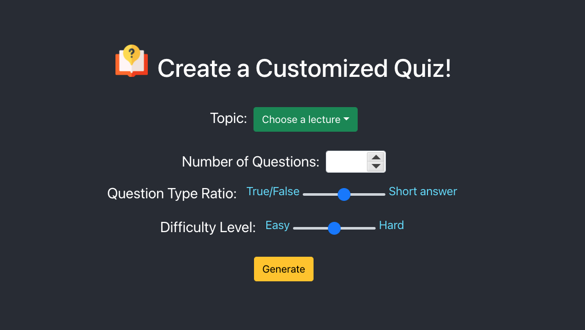

# Creating Customized Quiz from Learning Materials

## Introduction

Final Project of CS492 Introduction to Deep Learning

Team 44 - Saelyne Yang, Yoonjoo Lee

Our project generates customized quiz (QA sets) that asks about concepts and relationships between them.

## Code sturcture

    .
    ├── app     # Source code for the web application
    │   ├── src
    │   │   ├── App.js          # Main page
    │   │   ├── components
    │   │   │   ├── Questions.jsx   # Questions page
    │   │   │   ├── Grade.jsx       # Grading page
    ├── data    # Dataset of QA sets generated from our model
    │   └── ai_data_new.json        # QA sets for the lecture "AI"
    │   └── iot_data_new.json       # QA sets for the lecture "IoT"
    └── model

## How to run the application

navigate to `app/` and run `npm install`, `npm start`

## Application screenshot

